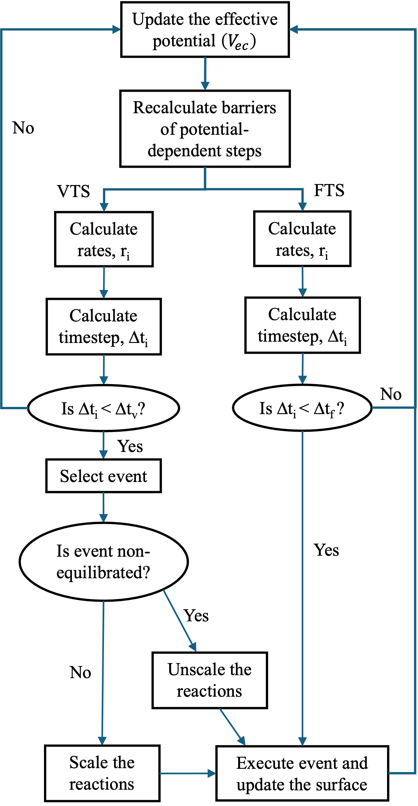

# Electrochemical Reaction (methyl-2-thiophene carboxylate reduction)
This repository is for the relevant files for performing and visualizing kinetic monte carlo simulations (kMC) presented in the paper, "Application of first principles based stochastic simulation of surface kinetics for Arene Electrohydrogenation". While the provided input files run kMC simulations specifically for methyl-2-thiophene carboxylate reduction on a pristine graphene surface, the input files can be appropriately modified to extend it to different surface chemistries on different metals and different facets lying within the scope of the program. <newline>

# Software Version used:
```
GCC version: 4.4.7
mpiexec compiler version: 1.6.2
```

# Algorithmic Details of the kMC code:
The schematic flowchart of the accelerated kMC algorithm is shown in the figure below:


The step by step outline of the kMC algorithm is as follows:
1) Generate an initial surface configuration ($\delta$) (t = 0) and initialize the kinetic and interaction parameters.
2) Check if the oscillation parameter needs to be changed or not. If it is to be changed, update the kinetic parameters. For electrochemical systems with potential loss taken into account, the potential is updated after every kMC step using the following equation, <br>
$V_{ec}=V_{max}*\left(1-exp\left(-\frac{t}{RC}\right)\right)$ <br>
where $V_{ec}$ is the effective potential at electrode surface after a timestep t, $V_{max}$ is the target potential with respect to the reference potential, R is the resistance of EDL, and C is the capacitance of the EDL. <br>
Using the updated surface potential, recalculate the activation barrier for every potential-dependent elementary steps.
3) Equilibrate the surface with the fast elementary steps set by the user using the Donghai approach and update the surface configuration ($\gamma$).
4) Determine the reaction rate $r_{γβ}$ for all the slow elementary steps taking surface configuration from $\gamma$ to a surface configuration $\beta$ and calculate the total reaction rate as <br>
$r_{tot(\gamma)}=\sum_{\beta} r_{\gamma\beta}$ 
5) Select the elementary step i taking the surface configuration from $\gamma \to \gamma'$ such that the following inequality holds <br>
$\sum_{\beta < \gamma'-1} r_{\gamma\beta} < \rho_1 \times r_{tot(\gamma)} \leq \sum_{\beta < \gamma'} r_{\gamma\beta}$ <br>
where $\rho_1$ is a randomly generated number form a uniform distribution in the interval [0,1]
6) Advance the time using a second random number using the equation below <br>
$t=t-\frac{ln\rho_2}{r_{tot(\gamma)}}$ <br>
where $\rho_2$ is a randomly generated number from a uniform distribution in the interval [0,1]
7) Calculate the equilibration ratio ($e$) of the selected step using equation below. If the ratio is within the tolerance specified by the user, mark the step as equilibrated. <br>
$e=\frac{N_f-N_b}{N_f}$ <br>
where $N_f$ and $N_b$ is the number of forwrad and backward steps respectively recorded in the current superbasin
8) If the selected step is equilibrated and has been executed more than the user specified frequency in the current superbasin, rescale the preexponential factor of both forward and reverse step using the scaling factor (α) calculated as <br>
$\alpha = \frac{r_{max.avg}}{(\frac{r_{f,i}+r_{b,i}}{2})}$ <br>
where $r_{max,avg}$ is the maximum rate among unequilibrated steps averaged over time in the current superbasin, $r_{f,i}$ is the averaged rate over time of the forward selected step and $r_{b,i}$ is the averaged rate over time of the backward selected step. The time-averaged rate of the elementary step i ($r_i$) is calculated using: <br>
$r_i= \frac{1}{\Delta t_s} \sum_{j} r_{i,j} \Delta t_j$ <br>
where $\Delta t_s$ is the time spent in the superbasin, $\Delta t_j$ is the time step of each kMC step j and $r_{i,j}$ is the rate of elementary step $i$ at kMC step j.
9) If the selected step is an unequilibrated step, rescale the scaling factor ($\alpha$) of all the slow steps specified by the user to 1.
10) Update the system configuration from $\gamma$ to $\gamma$' and go to step 2. 

# Cloning the Repository:
To clone this repository to your computer, use the following code:
```
~$ git clone https://github.com/rjtdaga/ThiopheneElectroreduction.git ThiopheneElectroreduction
```

# Creating an Input file
A single text input file is used to run the kMC simulation. An example, "InputFile.in" is provided in the repository. Detailed information about the input files is provided in the folder named "Input Files".

# Running the Build file
Folder "Program" already contains the compiled program with all the necessary files embedded into it. To run it on your system, use the following command
```
mpirun -np 5 ./KineticMC InputFile OutputFile
```
where -np represents the number of processors to be used. Use 1 if only one process is to be run and increment it based on the parallel simulations to be run. KineticMC is the compiled program, InputFile is the path of input file and OutputFile is the of summarized output file to be created

# Instructions for generating snapshots and creating simulation movies
The kMC simulation will generate Coordinates<N>.xyz files where N is the rank of the process. This file contains the coordinates of all the atoms in the system after every kMC simulation step and can be used with any appropriate visualizer/movie maker. This repository includes a custom movie generator with the code written in MATLAB in folder "MATLAB Movie". Folder xx contains the necessary details and instructions to make the snapshot or movie with the .xyz file provided.
